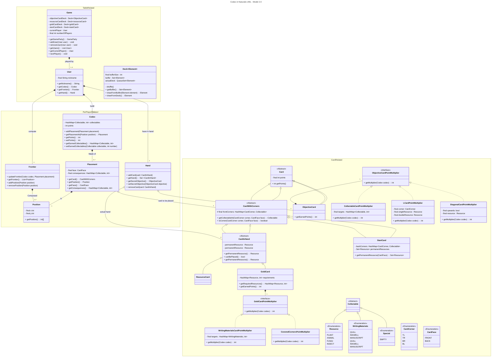

# This is a first draft of the UML diagram for the project.

```mermaid
---
title: Codex in Naturalis UML - Model 2.0
---
classDiagram
    direction TB
    Card <|-- CardWithCorners
    Card <|-- ObjectiveCard
    CardWithCorners <|-- CardInHand
    CardWithCorners <|-- StartCard
    direction TB
    Card <|-- CardWithCorners
    Card <|-- ObjectiveCard
    CardWithCorners <|-- CardInHand
    CardWithCorners <|-- StartCard

    CardInHand <|--ResourceCard
    CardInHand <|--GoldCard

    GoldCard *-- "1" GoldCardPointMultiplier


    GoldCardPointMultiplier  <|.. WritingMaterialsCardPointMultiplier
    ObjectiveCardPointMultiplier  <|.. CollectableCardPointMultiplier

    GoldCardPointMultiplier  <|.. CoveredCornersPointMultiplier
    ObjectiveCardPointMultiplier <|.. LCardPointMultiplier
    ObjectiveCardPointMultiplier <|.. DiagonalCardPointMultiplier


    ObjectiveCardPointMultiplier "1"--* ObjectiveCard


    Collectable <|-- Resource
    Collectable <|-- WritingMaterials
    Collectable <|-- Special


    namespace CardRelated{
        class Card{
            <<Abstract>>
            - final int points
            + int getPoints()
        }

        class Collectable{
            <<Abstract>>
        }

        class Resource{
            <<Enumeration>>
            PLANT
            ANIMAL
            FUNGI
            INSECT
        }

        class WritingMaterials{
            <<Enumeration>>
            QUILL
            INKWELL
            MANUSCRIPT
        }
            class WritingMaterials{
                <<Enumeration>>
                QUILL
                INKWELL
                MANUSCRIPT
            }

        class Special{
            <<Enumeration>>
            EMPTY
        }

        class CardWithCorners{
            <<Abstract>>
            # final frontCorners: HashMap~CardCorner, Collectable~
            + getCollectableAt(CardCorner corner, CardFace face) : Collectable
            + isCorner(CardCorner corner, CardFace face) : boolean
        }

        class CardInHand{
            <<Abstract>>
            - permanentResource : Resource
            + getPermanentResource() : Resource
            + canBePlaced() : bool
        }
            class CardInHand{
                <<Abstract>>
                - permanentResource : Resource
                + getPermanentResource() : Resource
            }

        class GoldCard{
            - HashMap~Resource, int~ requirements
            + getRequiredResources() : HashMap~Resource, int~
            + getEarnedPoints() : int
        }

        class ObjectiveCard{
            + getEarnedPoints() : int
        }

        class ObjectiveCardPointMultiplier{
            <<Interface>>
            + getMultiplier(Codex codex) : int
        }

        class GoldCardPointMultiplier{
            <<Interface>>
            + getMultiplier(Codex codex) : int
        }

        class CollectableCardPointMultiplier{
            - final targets : HashMap~Collectable, int~
            + getMultiplier(Codex codex) : int
        }

        class WritingMaterialsCardPointMultiplier{
            - final targets : HashMap~WritingMaterials, int~
            + getMultiplier(Codex codex) : int
        }


        class LCardPointMultiplier{
            - final corner: CardCorner
            - final singleResource : Resource
            - final doubleResource: Resource
            + getMultiplier(Codex codex) : int
        }

        class DiagonalCardPointMultiplier{
            - final upwards: bool
            - final resource : Resource
            + getMultiplier(Codex codex) : int
        }

        class CoveredCornersPointMultiplier{
            + getMultiplier(Codex codex) : int
        }

        class ResourceCard{
        }

        class StartCard{
            - backCorners: HashMap~CardCorner, Collectable~
            - Set~Resource~ permanentResources
            + getPermanentResource(CardFace) : Set~Resource~
        }

        class CardCorner{
            <<Enumeration>>
            TL
            TR
            BR
            BL
        }

        class CardFace{
            <<Enumeration>>
            FRONT
            BACK
        }
    }

    Placement *-- "1" Position : in
    Placement o-- "1" CardWithCorners : card to be placed

    Codex *-- "0..*" Placement : Made of

    Frontier *-- "0..*" Position : Composed

    Hand o-- "1" ObjectiveCard : Secret Objective
    Hand o-- "3" CardInHand : actual hand

    namespace PerPlayerRelated{
        class Position{
            - final x:int
            - final y:int
            + getPosition() : int[]
        }

        class Placement{
            - final face: CardFace
            - final consequences: HashMap~Collectable, int~
            + getCard() : CardWithCorners
            + getPosition() : Position
            + getFace() : CardFace
            + getConsequences() : HashMap~Collectable, int~
        }

        class Codex{
            - HashMap~Collectable, int~ collectables
            - int points
            + addPlacement(Placement placement)
            + getPlacementAt(Position position) : Placement
            + getPoints() : int
            + setPoints() : int
            + getEarnedCollectables() : HashMap~Collectable, int~
            + setEarnedCollectables(Collectable collectable, int number)
        }

        class Frontier{
            + updateFrontier(Codex codex, Placement placement)
            + getFrontier() : List~Position~
            + addPosition(Position position)
            + removePosition(Position position)
        }

        class Hand{
            + addCard(card: CardInHand)
            + getHand() : Set ~CardInHand~
            + getSecretObjective() : ObjectiveCard
            + setSecretObjective(ObjectiveCard objective)
            + removeCard(card: CardInHand)
        }
    }

    User *-- "1" Codex : build
    User *-- "1" Frontier : compute
    User *-- "1" Hand : have in hand
    Game *-- "1..4" User : played by


    namespace TableRelated{
        class User{
            - final String nickname
            + getNickname() : String
            + getCodex() : Codex
            + getFrontier() : Frontier
            + getHand() : Hand
        }

        class Deck ~Element~{
            final bufferSize : int
            buffer : Set~Element~
            actualDeck : QueueSet~Element~
            - shuffle()
            + getBuffer() : Set~Element~
            + drawFromBuffer(Element element) : Element
            + drawFromDeck() : Element
        }

        class Game{
            - objectiveCardDeck : Deck~ObjectiveCard~
            - resourceCardDeck : Deck~resourceCard~
            - goldCardDeck : Deck~goldCard~
            - startCardDeck : Deck~startCard~
            - currentPlayer : User
            - final int numberOfPlayers
            + getGameParty() : GameParty
            + addUser(User user) : void
            + removeUser(User user) : void
            + getUsers() : List~User~
            + getCurrentPlayer() : User
            + nextPlayer() : void
        }
}
```
