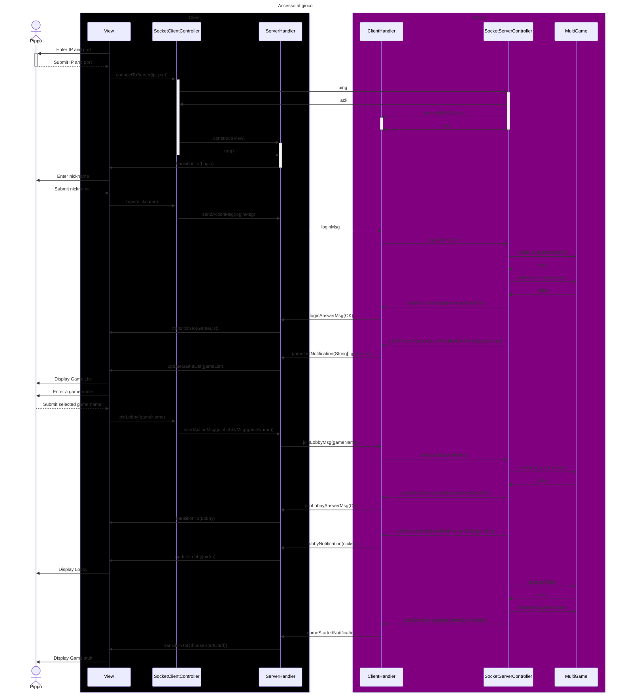

```mermaid
sequenceDiagram
    title: Accesso al gioco
    actor Pippo

    box black Client
        participant View
        participant SocketClientController
        participant ServerHandler
    end

    box purple Server
        participant ClientHandler
        participant SocketServerController
        participant MultiGame
    end

    View ->> +Pippo : Enter IP and port
    Pippo -->> -View : Submit IP and port
    View ->> + SocketClientController : connectToServer(ip, port)
    activate SocketClientController
    SocketClientController ->> +SocketServerController : ping
    SocketServerController ->> SocketClientController : ack

    SocketServerController ->> ClientHandler : contruct(MultiGame)
    activate ClientHandler
    SocketServerController ->> -ClientHandler : run()
    deactivate ClientHandler

    SocketClientController ->> +ServerHandler : construct(View)
    SocketClientController ->> ServerHandler : run()
    deactivate SocketClientController
    ServerHandler ->> -View : transitionTo(Login)

    View ->> Pippo : Enter nickname
    Pippo -->> View : Submit nickname

    View ->> SocketClientController : login(nickname)

    SocketClientController ->> ServerHandler : sendActionMsg(loginMsg)

    ServerHandler ->> ClientHandler : loginMsg

    ClientHandler ->> SocketServerController : login(nickname)

    SocketServerController ->> MultiGame : isNickUnique(nickname)

    MultiGame -->> SocketServerController : true

    SocketServerController ->> MultiGame : isNickInGame(nickname)

    MultiGame -->> SocketServerController : false

    SocketServerController ->> ClientHandler : sendServerMsg(loginAnswerMsg(OK))

    ClientHandler ->> ServerHandler : loginAnswerMsg(OK)

    ServerHandler ->> View : transitionTo(GameList)

    SocketServerController ->> ClientHandler : sendServerMsg(gameListNotification(String[] gameList))

    ClientHandler ->> ServerHandler : gameListNotification(String[] gameList)

    ServerHandler ->> View : updateGameList(gameList)

    View ->> Pippo : Display Game List

    View ->> Pippo : Enter a game name

    Pippo -->> View : Submit selected game name

    View ->> SocketClientController : joinLobby(gameName)


    SocketClientController ->> ServerHandler : sendActionMsg(joinLobbyMsg(gameName))

    ServerHandler ->> ClientHandler : joinLobbyMsg(gameName)

    ClientHandler ->> SocketServerController : joinLobby(gameName)

    SocketServerController ->> MultiGame : joinLobby(gameName)

    MultiGame -->> SocketServerController : true

    SocketServerController ->> ClientHandler : sendServerMsg(joinLobbyAnswerMsg(OK))

    ClientHandler ->> ServerHandler : joinLobbyAnswerMsg(OK)

    ServerHandler ->> View : transitionTo(Lobby)

    SocketServerController ->> ClientHandler : sendServerMsg(lobbyNotification(String[] nicks))

    ClientHandler ->> ServerHandler : lobbyNotification(nicks)

    ServerHandler ->> View : updateLobby(nicks)

    View ->> Pippo : Display Lobby

    SocketServerController ->> MultiGame : isLobbyFull()

    MultiGame -->> SocketServerController : true

    SocketServerController ->> MultiGame : startGame(gameName)

    SocketServerController ->> ClientHandler : sendServerMsg(gameStartedNotification)

    ClientHandler ->> ServerHandler : gameStartedNotification

    ServerHandler ->> View : transitionTo(ChooseStartCard))

    View ->> Pippo : Display Game stuff

```
