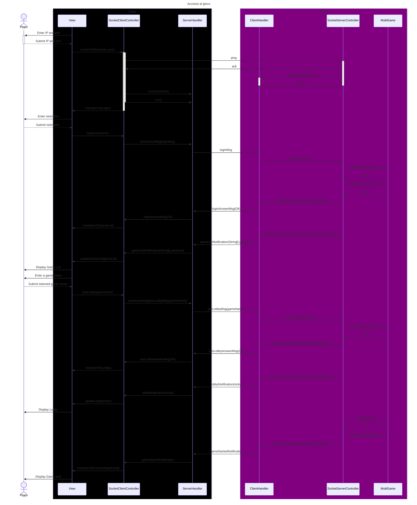

# Sequence Diagram Report: Game Access Flow

## Objective

The sequence diagram illustrates the flow of actions involved in accessing a game, from the initial connection to navigating through game lobbies.

## Actors

- Pippo: The player or user interacting with the game.

## Components

- Client:

  - View: The visual interface where the user interacts.
  - SocketClientController: It's the bridge between the view and the web communation. It has the methods to send data to the server and to react to the server's messages. The latter are inherited from the parent and are the same for both the Socket and RMI implementations.

  - ServerHandler: Manages communication with the server.

- Server:

  - ClientHandler: Handles client connections and requests.
  - SocketServerController: It's the bridge between the web communation and the model. It has the methods to send data to the client and to react to the client's messages. The latter are inherited from the parent and are the same for both the Socket and RMI implementations.

  - MultiGame: Manages multiple game instances and lobbies. There is only one MultiGame instance for the whole server.

## Disclaimer

The diagram has been written with an optimistic approach, assuming that all the actions are successful. The diagram does not include error handling or failure cases.

## Flow:

- Initial Connection:

  - Pippo enters the IP and port to connect.
  - The View forwards this to the SocketClientController, which initiates the connection.
  - SocketClientController pings the SocketServerController for acknowledgment.
  - If successful, the SocketServerController constructs a ClientHandler to handle the connection.

- Login Process:

  - Pippo submits a nickname.
  - The View sends this to the SocketClientController, which then logs in using the provided nickname.
  - Server-side components check if the nickname is unique and not already in use in any ongoing game.
  - If the nickname is unique and not in use, Pippo is logged in successfully and transitions to the game list interface.

- Game Lobby Access:

  - Pippo selects a game from the displayed list.
  - The chosen game name is sent to the SocketClientController, initiating the process to join the lobby.
  - The server-side components ensure that the lobby is available and not full.
  - If the lobby is available, Pippo successfully joins and transitions to the lobby interface.

- Game Start:
  - Once the lobby is full, the game starts.
  - Players receive notifications, and the interface transitions to the game interface.
