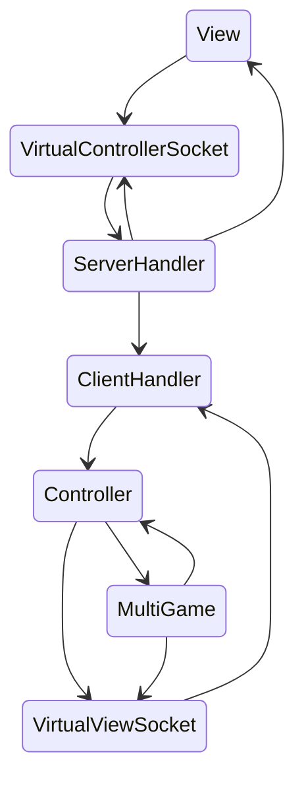
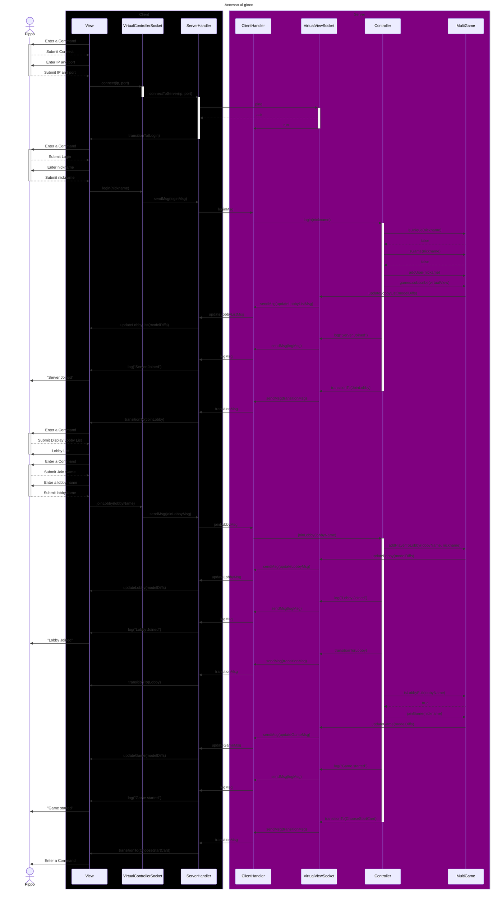

# Sequence Diagram Report: Game Access Flow

## Objective

The sequence diagram illustrates the flow of actions involved in accessing a game, from the initial connection to navigating through game lobbies.

## Actors

- Pippo: The player or user interacting with the game.

## Components

- Client:

  - View: The user interface that displays the game and handles user input.
  - VirtualControllerSocket: Manages communication with the actual controller. It implements a Controller interface.
  - ServerHandler: Handles the connection between the client and the server handling the Socket messages.

- Server:

  - ClientHandler: Manages the client connection on the server side.
  - VirtualViewSocket: Manages communication with the actual view. It implements a View interface.
  - Controller: The controller that processes the user input and updates the model.
  - MultiGame: The model that manages the game state and player interactions.

## Disclaimer

The diagram has been written with an optimistic approach, assuming that all the actions are successful. The diagram does not include error handling or failure cases.

## Flow:

- Initial Connection:

  - Pippo enters the IP and port to connect.
  - The View sends the IP and port to the VirtualControllerSocket.
  - The VirtualControllerSocket connects to the server using the provided IP and port.
  - The ServerHandler establishes the connection with the server.
  - The server-side components acknowledge the connection and transition the View to the login interface.

- Login Process:

  - Pippo enters a nickname.
  - The View sends the nickname to the VirtualControllerSocket.
  - The VirtualControllerSocket sends a login message to the server.
  - The server-side components process the login message.
  - The Controller checks if the nickname is unique and not already in a game.
  - If the nickname is unique, the Controller adds the player to the game and subscribes the Virtual View to the game updates.
  - The MultiGame model updates the lobby list and notifies the Virtual Views.
  - The View transitions to the lobby interface.

- Game Lobby Access:

  - Pippo requests to join a game lobby.
  - The View sends the lobby name to the VirtualControllerSocket.
  - The VirtualControllerSocket sends a join lobby message to the server.
  - The server-side components process the join lobby message.
  - The Controller adds the player to the lobby and updates the lobby model.
  - The MultiGame model updates the lobby and notifies the Virtual Views.
  - The View transitions to the lobby interface.

- Game Start:

  - The Controller checks if the lobby is full.
  - If the lobby is full, the Controller starts the game.
  - The MultiGame model updates the game state and notifies the Virtual Views.
  - The View transitions to the game interface.
