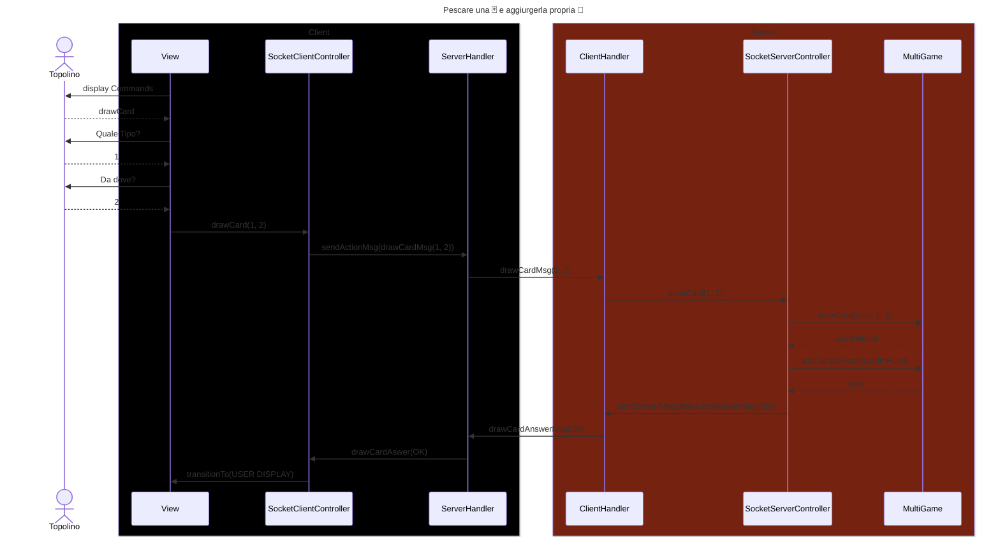

```mermaid
sequenceDiagram
    title: Pescare una 🃏 e aggiurgerla propria 🤚
    actor Topolino

    box black Client
        participant View
        participant SocketClientController
        participant ServerHandler
    end

    box rgb(117, 35, 16) Server
        participant ClientHandler
        participant SocketServerController
        participant MultiGame
    end

    View ->> Topolino : display Commands
    Topolino -->> View : drawCard

    %% ResourceCard (0) / GoldCard (1)
    View ->> Topolino : Quale Tipo?
    Topolino -->> View : 1

    %% Buffer (0/1) - Deck (2)
    View ->> Topolino : Da dove?
    Topolino -->> View : 2

    View ->> SocketClientController : drawCard(1, 2)

    SocketClientController ->> ServerHandler : sendActionMsg(drawCardMsg(1, 2))

    ServerHandler ->> ClientHandler : drawCardMsg(1, 2)

    ClientHandler ->> SocketServerController : drawCard(1, 2)

    SocketServerController ->> MultiGame : drawCard(user, 1, 2)

    MultiGame -->> SocketServerController : cardInHand

    SocketServerController ->> MultiGame : addCardToHand(cardInHand)

    MultiGame -->> SocketServerController : true

    SocketServerController ->> ClientHandler : sendServerMsg(drawCardAnswerMsg(OK))

    ClientHandler ->> ServerHandler : drawCardAnswerMsg(OK)

    ServerHandler ->> SocketClientController : drawCardAswer(OK)

    SocketClientController ->> View : transitionTo(USER DISPLAY)
```
