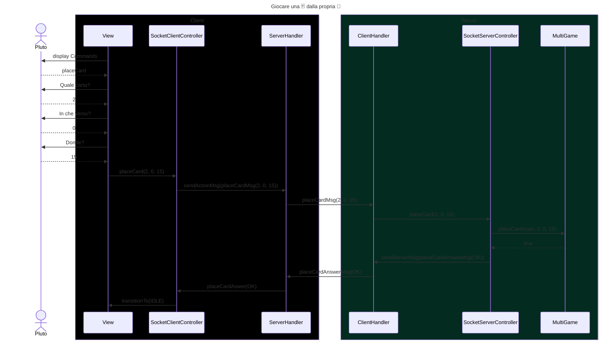

```mermaid
sequenceDiagram
    title: Giocare una 🃏 dalla propria 🤚
    actor Pluto

    box black Client
        participant View
        participant SocketClientController
        participant ServerHandler
    end

    box rgb(4, 43, 32) Server
        participant ClientHandler
        participant SocketServerController
        participant MultiGame
    end

    View ->> Pluto : display Commands
    Pluto -->> View : placeCard

    View ->> Pluto : Quale carta?
    Pluto -->> View : 2

    View ->> Pluto : In che verso?
    Pluto -->> View : 0

    View ->> Pluto : Donde?
    Pluto -->> View : 15

    View ->> SocketClientController : placeCard(2, 0, 15)

    SocketClientController ->> ServerHandler : sendActionMsg(placeCardMsg(2, 0, 15))

    ServerHandler ->> ClientHandler : placeCardMsg(2, 0, 15)

    ClientHandler ->> SocketServerController : placeCard(2, 0, 15)

    SocketServerController ->> MultiGame : placeCard(user, 2, 0, 15)

    MultiGame -->> SocketServerController : true

    SocketServerController ->> ClientHandler : sendServerMsg(placeCardAnswerMsg(OK))

    ClientHandler ->> ServerHandler : placeCardAnswerMsg(OK)

    ServerHandler ->> SocketClientController : placeCardAswer(OK)

    SocketClientController ->> View : transitionTo(IDLE)
```
