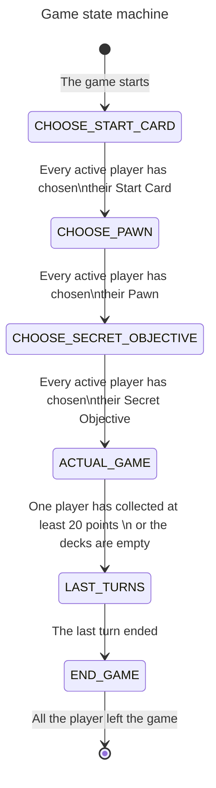

### State machine for the game

This state machine represents the game flow. The game starts with the players choosing their Start Card, then their Pawn, and finally their Secret Objective. All these phases are done in parallel.

After that, the actual game starts. The game ends when one player has collected at least 20 points or the decks are empty. The game then enters the last turns phase, where the players play their last turns. The game ends when the last turn ends.
When all the players leave the game, it is destroyed.
