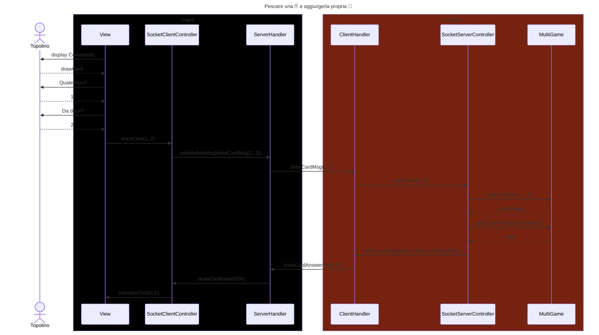

# Sequence Diagram Report: Draw Card Flow

## Introduction:
The sequence diagram illustrates the process of a user drawing a card from a deck. The system involves users interacting through a client interface and processing of actions within a server environment.

## Actors:

Topolino: the user initiates the card drawing process through interactions with the client interface.

## Components:
- Client:

  - View: The visual interface where the user interacts.
  - SocketClientController: It's the bridge between the view and the web communation. It has the methods to send data to the server and to react to the server's messages. The latter are inherited from the parent and are the same for both the Socket and RMI implementations.
  - ServerHandler: Manages communication with the server.

- Server:

  - ClientHandler: Handles client connections and requests.
  - SocketServerController: It's the bridge between the web communation and the model. It has the methods to send data to the client and to react to the client's messages. The latter are inherited from the parent and are the same for both the Socket and RMI implementations.

  - MultiGame: Manages multiple game instances and lobbies. There is only one MultiGame instance for the whole server.

## Disclaimer

The diagram has been written with an optimistic approach, assuming that all the actions are successful. The diagram does not include error handling or failure cases.

## Flow

    - Display Commands: The client's view displays available commands
    - Draw Card Request: The user use the command "drawCard" a card
    - Type of Card: The client is prompted to choose the type of card (Resource or Gold)
    - Source of Card: The client selects from where to draw the card; 0 for the deck, 1 and 2 for the respective position of the Buffer
    - Client to Server Interaction: 
        - The View calls a method of SocketClientController to drawCard() as parameter the type and the source of the draw
        - The SocketClientController forwards the request to the server through the ServerHandler, the ClientHandler, the SocketServerController
        - The SocketServerController sends the action to the Model represented by the Multigame, adding the card to the hand of the user and updating the buffers
    - CardAnswerMessage: the anser propagate through the network as the sendMessage to the SocketClientController
    - transitionTo(IDLE) : once the action is recived by the SocketClientController it updates the view transitioning it to the correct StateView 
