```mermaid
sequenceDiagram
    title: Giocare una 🃏 dalla propria 🤚
    actor Pluto

    box black Client
        participant View
        participant SocketClientController
        participant ServerHandler
    end

    box rgb(4, 43, 32) Server
        participant ClientHandler
        participant SocketServerController
        participant MultiGame
    end

    View ->> Pluto : display Commands
    Pluto -->> View : placeCard

    View ->> Pluto : Quale carta?
    Pluto -->> View : 2

    View ->> Pluto : In che verso?
    Pluto -->> View : 0

    View ->> Pluto : Donde?
    Pluto -->> View : 15

    View ->> SocketClientController : placeCard(2, 0, 15)

    SocketClientController ->> ServerHandler : sendActionMsg(placeCardMsg(2, 0, 15))

    ServerHandler ->> ClientHandler : placeCardMsg(2, 0, 15)

    ClientHandler ->> SocketServerController : placeCard(2, 0, 15)

    SocketServerController ->> MultiGame : placeCard(user, 2, 0, 15)

    MultiGame -->> SocketServerController : true

    SocketServerController ->> ClientHandler : sendServerMsg(placeCardAnswerMsg(OK))

    ClientHandler ->> ServerHandler : placeCardAnswerMsg(OK)

    ServerHandler ->> SocketClientController : placeCardAswer(OK)

    SocketClientController ->> View : transitionTo(IDLE)
```

# Sequence Diagram Report: Draw Card Flow

## Introduction:

The sequence diagram illustrates the process of a user placing a card from his hand on to his project. The system involves users interacting through a client interface and the processing of actions within a server environment.

## Actors:
Pluto: the user initiates the card placing process through interactions with the client interface.

## Components:
- Client:
    - View: The visual interface where the user interacts.
    - SocketClientController: It's the bridge between the view and the web communation. It has the methods to send data to the server and to react to the server's messages. The latter are inherited from the parent and are the same for both the Socket and RMI implementations.
    - ServerHandler: Manages communication with the server.

- Server:
  - ClientHandler: Handles client connections and requests.
  - SocketServerController: It's the bridge between the web communation and the model. It has the methods to send data to the client and to react to the client's messages. The latter are inherited from the parent and are the same for both the Socket and RMI implementations.
  - MultiGame: Manages multiple game instances and lobbies. There is only one MultiGame instance for the whole server.

## Disclaimer:

The diagram has been written with an optimistic approach, assuming that all the actions are successful. The diagram does not include error handling or 
failure cases.

## Flow:

    Display Commands: The client's view displays available commands
    Plce Card Request: Pluto initiates the place card action
    Card Selection: Pluto selects which card in its hand he wishes to place
    Card Orientation: Pluto selects which face to display upwards: front or back
    Codex Position: The user prompt where he wishes to place the card, selecting a position from the Frontier
    Client to Server Interaction:
        The View calls the SocketClientController's placeCard() method, passing the positionin in hand of the card, front or back display and the Frontier position where the user whishes to place the card.
        The SocketClientController forwards the request to the server through the ServerHandler, ClientHandler, and SocketServerController.
        The SocketServerController sends the action to the MultiGame model, where the user Hand, Codex and Frontier is updated.
    Card Answer Message: The server responds with a message confirming the successful place action, which propagates back to the client.
    Transition to User Display: Upon receiving the confirmation message, the SocketClientController updates the view, transitioning it to the appropriate state.