### State machine for the view

```mermaid
---
title: View state machine
---
stateDiagram-v2
    direction LR
    [*] --> SERVER_CONNECTION : The View is launched

    SERVER_CONNECTION --> SERVER_CONNECTION : The connection fails
    SERVER_CONNECTION --> LOGIN_FORM : Successful connection

    LOGIN_FORM --> LOGIN_FORM : The submitted nickname is not valid
    LOGIN_FORM --> JOIN_LOBBBY : The user logged in succesfully
    LOGIN_FORM --> SERVER_CONNECTION : The server diconnects

    JOIN_LOBBBY --> JOIN_LOBBBY : The user joined or created an invalid lobby
    JOIN_LOBBBY --> LOBBY : The user joined or created a valid lobby
    JOIN_LOBBBY --> SERVER_CONNECTION : The server diconnects

    LOBBY --> CHOOSE_START_CARD : All the necessary users joined the Lobby
    LOBBY --> SERVER_CONNECTION : The server diconnects

    WAITING_STATE --> CHOOSE_PAWN : All the active players chose their start card
    WAITING_STATE --> SERVER_CONNECTION : The server diconnects

    CHOOSE_START_CARD --> WAITING_STATE : The player chose the start card
    CHOOSE_START_CARD --> SERVER_CONNECTION : The server diconnects

    CHOOSE_PAWN --> WAITING_STATE : The player chose the pawn
    CHOOSE_PAWN --> SERVER_CONNECTION : The server diconnects

    WAITING_STATE --> SELECT_OBJECTIVE : All the active players chose their pawn

    SELECT_OBJECTIVE --> WAITING_STATE : The player chose the secret objective
    SELECT_OBJECTIVE --> SERVER_CONNECTION : The server diconnects

    WAITING_STATE --> IDLE : All the active players chose their secret objective

    IDLE --> PLACE_CARD : It's the player's turn
    IDLE --> SERVER_CONNECTION : The server diconnects

    PLACE_CARD --> IDLE : <center>The player placed a card and\nthe decks are empty</center>
    PLACE_CARD --> DRAW_CARD : <center>The player placed a card and\nthere are still cards in the decks</center>
    PLACE_CARD --> SERVER_CONNECTION : The server diconnects

    DRAW_CARD --> IDLE : <center>The player drew a card\n and it's not the last turn</center>
    DRAW_CARD --> GAME_ENDING : <center>The player drew a card\n ending the last turn</center>
    DRAW_CARD --> SERVER_CONNECTION : The server diconnects

    PLACE_CARD --> GAME_ENDING : <center>The decks are empty and \n the player ended the last turn</center>

    IDLE --> GAME_ENDING : Another player ended the last turn

    GAME_ENDING --> SERVER_CONNECTION : The player leaves the game
    GAME_ENDING --> SERVER_CONNECTION : The server diconnects
```

This state machine diagram illustrates the various states and transitions involved in the lifecycle of a game view. The process begins with attempting to establish a server connection. Upon a successful connection, the user is directed to the login form, where they must enter a valid nickname to proceed to the lobby. If any server disconnection occurs during these steps, the user is redirected back to the server connection state.

Once in the lobby, users can create or join a valid lobby. After all necessary users have joined, the state transitions to choosing a start card. Each subsequent phase (choosing a start card, choosing a pawn, and selecting a secret objective) involves all active players making their choices, interspersed with waiting states to ensure synchronization.

The game enters an idle state when all players have chosen their objectives. During a player's turn, they can place a card, leading to either the drawing of a new card, continuation in the idle state, or the transition to the game-ending state if it is the last turn or the decks are empty.

Throughout the game, any server disconnection redirects the user to the server connection state. The game concludes with the game-ending state, which also redirects to the server connection state upon completion or disconnection.
