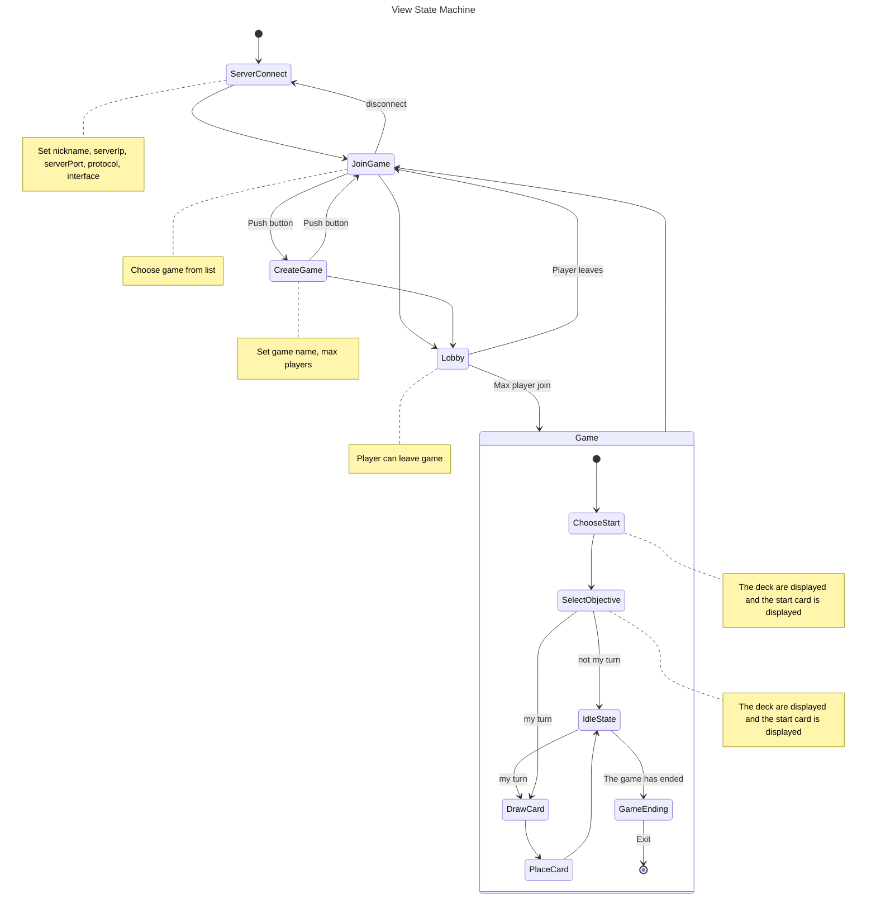

```mermaid
---
title: View State Machine
---
stateDiagram-v2

[*] --> ServerConnect

note right of ServerConnect
    Set nickname, serverIp, serverPort, protocol, interface
end note

ServerConnect --> JoinGame

note right of JoinGame
    Choose game from list
end note

JoinGame --> CreateGame : Push button
CreateGame --> JoinGame : Push button
JoinGame --> ServerConnect : disconnect

note right of CreateGame
    Set game name, max players
end note

JoinGame --> Lobby
CreateGame --> Lobby
Lobby --> JoinGame : Player leaves

note right of Lobby
    Player can leave game
end note

Lobby --> Game : Max player join

state Game {
    [*] --> ChooseStart
    note right of ChooseStart
        The deck are displayed and the start card is displayed
    end note

    ChooseStart --> SelectObjective
    note right of SelectObjective
        The deck are displayed and the start card is displayed
    end note

    SelectObjective --> IdleState : not my turn
    IdleState --> DrawCard : my turn
    SelectObjective --> DrawCard : my turn

    DrawCard --> PlaceCard

    PlaceCard --> IdleState

    IdleState --> GameEnding : The game has ended

    GameEnding --> [*] : Exit
}

Game --> JoinGame

```
